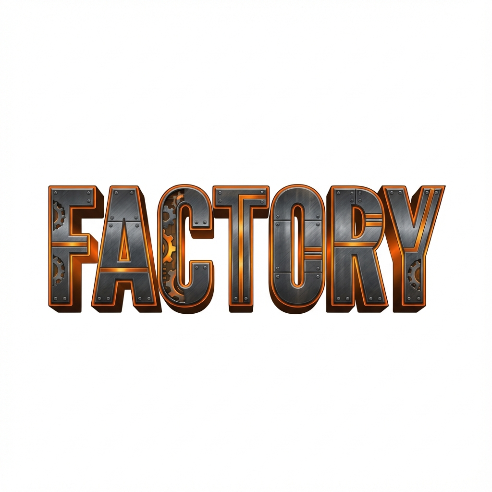

# Factory Automation Game



A web-based isometric factory building game inspired by classics like Factorio and Satisfactory. Built with Next.js and TypeScript.

## 🎮 Play Now

**[Play on Vercel](https://factory-git-main-tlaheys-projects.vercel.app/)**

## ✨ Features

- **Resource Extraction**: Mine resources automatically from the terrain.
- **Logistics**: Transport items using conveyor belts.
- **Storage**: Store your gathered resources in chests.
- **Isometric 3D View**: Beautiful 3D/2D hybrid visuals.
- **Web Based**: Runs directly in your browser.

## 🚀 Getting Started

First, run the development server:

```bash
npm run dev
# or
yarn dev
# or
pnpm dev
# or
bun dev
```

Open [http://localhost:3000](http://localhost:3000) with your browser to see the result.

## 🛠 Tech Stack

- **Framework**: Next.js
- **Language**: TypeScript
- **Styling**: Tailwind CSS / Custom CSS
- **Deployment**: Vercel
